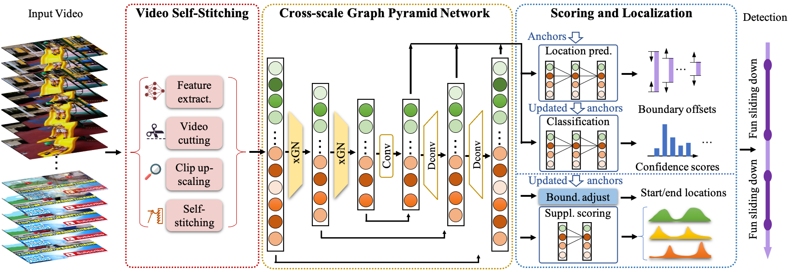

# VSGN

This repo holds the codes of paper: "[Video Self-Stitching Graph Network for Temporal Action Localization](https://arxiv.org/abs/2011.14598)", accepted to ICCV 2021.

## Updates
 - Aug. 15th: Code on THUMOS14 is published.

## VSGN Introduction

Temporal action localization (TAL) in videos is a challenging task, especially due to the large variation in action temporal scales. Short actions usually occupy the major proportion in the data, but have the lowest performance with all current methods. In this paper, we confront the challenge of short actions and propose a  multi-level cross-scale solution dubbed as video self-stitching graph network (VSGN). We have two key components in VSGN: video self-stitching (VSS) and cross-scale graph pyramid network (xGPN). In VSS, we focus on a short period of a video and magnify it along the temporal dimension to obtain a larger scale.  We stitch the original clip and its magnified counterpart in one input sequence to take advantage of the complementary properties of both scales. The xGPN component further exploits the cross-scale correlations by a pyramid of cross-scale graph networks, each containing a hybrid  module to aggregate features from across scales as well as within the same scale. Our VSGN not only enhances the feature representations, but also generates more positive anchors for short actions and more short training samples. Experiments demonstrate that VSGN obviously improves the localization performance of short actions as well as achieving the state-of-the-art overall performance on THUMOS-14 and  ActivityNet-v1.3.


## Project Architecture
An overview of the project architecture in repo is shown below.
```
    VSGN                            
    ├── Models/*                    # Network modules and losses
    ├── Utils/*                     # Data loading and hyper-parameters
    ├── Evaluation/*                # Post-processing and performance evaluation
    ├── DETAD/*                     # DETAD evaluation for diagnosing error types   
    ├── Cut_long_videos.py          # Cutting long videos      
    ├── Train.py                    # Training starts from here      
    ├── Infer.py                    # Inference starts from here    
    ├── Eval.py                     # Evaluation starts from here             
    └── ...
```
- Functions for video cutting in **VSS** are in [`Cut_long_videos.py`](./Cut_long_videos.py).
- Functions for clip up-scaling and self-stitching in **VSS** are in [`Utils/dataset_thumos.py`](./Utils/dataset_thumos.py).
- Network model is defined in [`Model/VSGN.py`](./Models/VSGN.py), with detailed implementation of of different modules in different files in [`Models`](./Models).
- Losses are defined in [`Models/Loss.py`](./Models/Loss.py)
- We use pre-extracted video features. THUMOS14 features can be found [here](https://drive.google.com/drive/folders/1-19PgCRTTNfy2RWGErvUUlT0_3J-qEb8).


## Pre-trained Models and Performance

### THUMOS14

The results are a bit different from the ones reported in the paper due to randomness.

| Method | Model | 0.3 | 0.4 | 0.5 | 0.6 | 0.7 | Average | Short |
|---------|--------|-----|--------|-----|-----|-------|--------|--------|
|Baseline |
| VSGN |


## Environment Installation
Create a conda environment and install required packages from scratch following the steps below
```
    conda create -n pytorch110 python=3.7 
    conda activate pytorch110   
    conda install pytorch=1.1.0 torchvision cudatoolkit=10.0.130 -c pytorch   
    conda install -c anaconda pandas    
    conda install -c anaconda h5py  
    conda install -c anaconda scipy 
    conda install -c conda-forge tensorboardx   
    conda install -c anaconda joblib    
    conda install -c conda-forge matplotlib 
    conda install -c conda-forge urllib3
```
OR you can create a conda environment from our `env.yml` file using the following command
```
    conda env create -f env.yml
```


## Code and Data Preparation
Download the TSN features of the THUMOS14 dataset from [here](https://drive.google.com/drive/folders/1-19PgCRTTNfy2RWGErvUUlT0_3J-qEb8), and save it in `[DATA_PATH]`.


Clone this repo with git
```
    git clone git@github.com:coolbay/VSGN.git
```

## Run the Code
### Training

```    
     python Train.py --is_train true --dataset thumos --feature_path [DATA_PATH]  --checkpoint_path [CHECKPOINT_PATH]  
```
### Inference
```
     python Infer.py --is_train false --dataset thumos --feature_path [DATA_PATH] --checkpoint_path [CHECKPOINT_PATH]  --output_path [OUTPUT_PATH]   
```
### Evaluation
```
     python Eval.py --dataset thumos --output_path [OUTPUT_PATH]
```
### Run training / inference / evaluation in one command
```
    bash run_vsgn.sh traininfereval     # Run train, infer, and eval 
    bash run_vsgn.sh train              # Only run train
    bash run_vsgn.sh infer              # Only run infer
    bash run_vsgn.sh eval               # Only run eval
    bash run_vsgn.sh traininfer         # Run train and infer
```
## Cite this paper
Please cite the following paper if this codebase is useful for your work.
```
    @article{zhao2020video,
      title={Video Self-Stitching Graph Network for Temporal Action Localization},
      author={Zhao, Chen and Thabet, Ali and Ghanem, Bernard},
      journal={arXiv preprint arXiv:2011.14598},
      year={2020}
    }
```


[comment]: <> (test_info.mat)

[comment]: <> (val_info.mat)

[comment]: <> (thumos_classes_idx.json)

[comment]: <> (3. thumos14_test_groundtruth.csv)

[comment]: <> (5. thumos_gt.json)

[comment]: <> (6. test_Annotation.csv)
